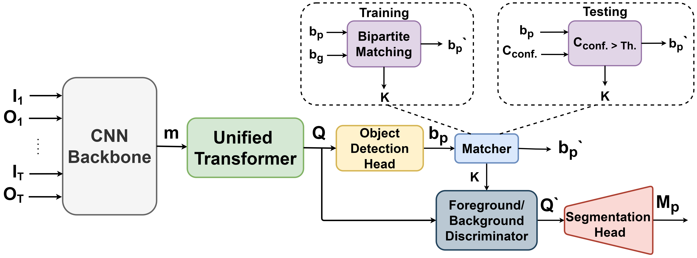
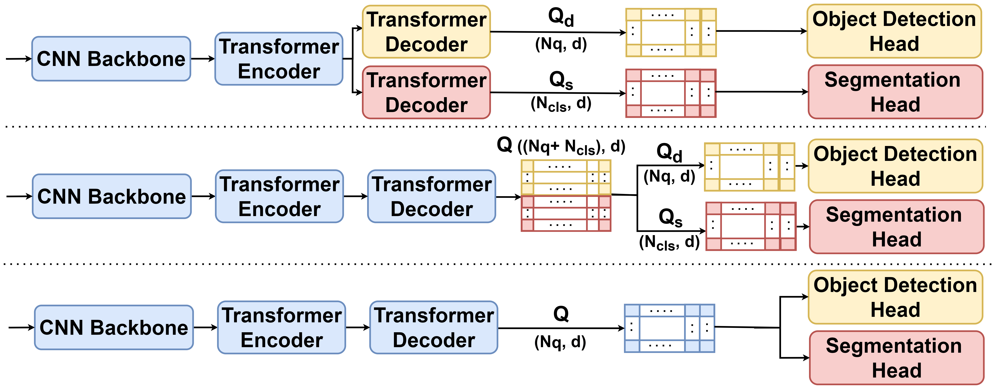

# MTL-TransMODS: Cascaded Multi-Task Learning for Moving Object Detection and Segmentation with UnifiedTransformers
This is the official implementation for our paper;"MTL-TransMODS: Cascaded Multi-Task Learning for Moving Object
Detection and Segmentation with UnifiedTransformers".


## Introduction
Recently, transformer-based networks have achieved state-of-the-art performance in computer vision tasks.
This paper proposes a new cascaded MTL transformer-based framework, termed MTL-TransMODS, that tackles the moving
object detection and segmentation tasks due to its importance for Autonomous Driving tasks. 
A critical problem in this task is how to model the spatial correlation in each frame and the temporal relationship
across multiple frames to capture the motion cues.
MTL-TransMODS introduces a vision transformer to employ the temporal and spatial associations and tackles both tasks
using only one fully shared transformer architecture with unified queries. 
Extensive experiments demonstrate the superiority of our MTL-TransMODS over state-of-the-art methods on the
KittiMoSeg dataset. 
Results show 0.3% mAP improvement for Moving Object Detection and 5.7% IoU improvement for Moving Object Segmentation
over the state-of-the-art techniques. 
<p align="center">
  
</p>

## Architecture
<p align="center">
  
</p>
Our approach is divided into three main parts:

1- Novel formulation for the segmentation task w.r.t transformer architectures

we adopt DETR’s architecture by formulating the semantic segmentation task as a problem of a dictionary lookup table
 and adapt DETR decoder by representing each category using a set of learnable queries while DETR’s queries represent 
 each object.
Moreover, term the segmentation-queries Qs. Following this segmentation task formulation, we can follow the
vanilla detection transformer pipeline to produce class-aware queries driven from the produced object queries.

2- Cascaded-MTL-Transformer model.

Learning segmentation queries that represent object categories can be achieved using a dedicated Transformer Decoder,
 as shown in the upper part in the aforementioned figure.
Another approach is to use one shared Transformer Decoder to produce the two tasks queries, Q, in a one-shot, 
which are later split into two sets; detection
queries Qd and segmentation queries Qs, as shown in the middle part of the figure.
Unified Queries (UQ) are introduced by decomposing the segmentation task into two related
sub-tasks,i.e., 1) Discriminating objects. 2) Mask generation. 
A simple yet effective way to discriminate the objects in the scene is to determine the boundary of
the objects by bounding them using class agnostic boxes. 
After discriminating the objects in the scene, we generate the segmentation masks by predicting the
category-wise label for each pixel guided by the discriminated objects.
Interpreting the cascaded analogy to the transformer based neural network,
discriminating objects can be regarded as detection queries.
<p align="center">
  
</p>

3- Spatio-Temporal transformer architecture

We encode motion cues by utilizing two mechanisms; through the Optical Flow (OF) using FlowNet 2.0, and
using multiple streams of T time stamps.

## Prerequisites
* Python >= 3.5
* Pytorch >= 1.7.0
* Please refer to ``requirements.py``.

## Training
To train on KITTI dataset use the following command:
```
python main.py --coco_path /media/user/x_2/proj3054_moving_instance_segmentation/data/kitti --dataset_file "kitti_old"
--resume weights/detr-r50-e632da11.pth --output_dir ./log_kitti_old/
```

## Evaluation
To eval on KITTI dataset use the following command:
```
python main.py --coco_path /media/user/x_2/proj3054_moving_instance_segmentation/data/kitti --dataset_file "kitti_old"
--batch_size 2 --no_aux_loss --eval --resume log_baseline_kitti_old/checkpoint_best.pth
```

## Credits
The project is built based on the following repository:
* [DETR](https://github.com/facebookresearch/detr).


# License
MTL-TransMODS is released under the Apache 2.0 license. Please see the [LICENSE](LICENSE) file for more information.

# Contributing
We actively welcome your pull requests! Please see [CONTRIBUTING.md](.github/CONTRIBUTING.md) and [CODE_OF_CONDUCT.md](.github/CODE_OF_CONDUCT.md) for more info.
